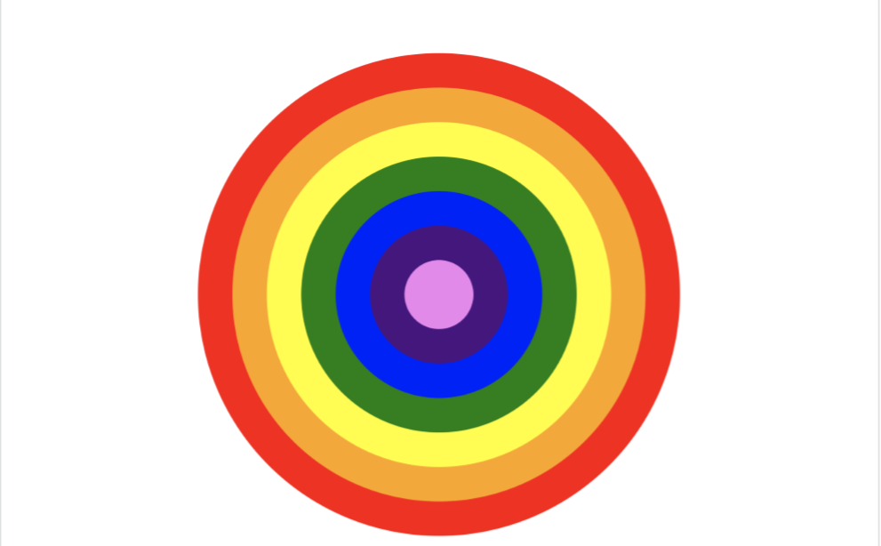

# **Занятие 2**
## Git, HTML, CSS

## **Git**

* git init
* git clone
* git status
* git config
* git add
* git commit
* git log
* git revert
* git remote add
* git pull
* git push

## **HTML теги**

* С закрывающим тэгом `<html>Something</html>`
* Без закрывающего тега `<input>`
* Параметры

  `
Something
`
* Вложенность тегов `<html><head>…</head></html>`

## **Несколько тегов**

* html
* head
* meta
* title
* link
* body
* div

## **Несколько свойств тегов**

* class
* href
* lang

## **Базовый шаблон html файла**

`<!doctype html>`

`<html lang="">`

`<head>`

`<meta charset="utf-8">`

`<meta http-equiv="x-ua-compatible" content="ie=edge">`

`<title>Title</title>`

`<meta name="viewport" content="width=device-width, initial-scale=1, shrink-to-fit=no">`

`<link rel="stylesheet" href="main.css">`

`</head>`

`<body>`

`Content`

`</body>`

`</html>`

## **CSS классы**

.class-name {

property1-name: property1-value;

property2-name: property2-value;

…

}

## **Общие свойства нескольких классов**

.class-1, .class-2, .class-3 {

common-property-1: common-property-value-1;

…

}

## **Несколько свойств CSS**

* position: static | absolute | fixed | relative
* top, bottom, left, right
* Значение - 10px (без кавычек)
* display: flex 
https://css-tricks.com/snippets/css/a-guide-to-flexbox/
* align-items, justify-content
* background-color: red | #327a15 | rgba(10, 20, 30, 0.5)

## **Задание 2**

## **Постановка задачи**

* Цветной объект должен иметь диаметр 700 пикселей.
* Цветной объект должен располагаться по центру экрана по горизонтали и
вертикали. Он должен оставаться по центру экрана при изменении размера окна
браузера

* Объект должен состоять из колец и центральной окружности, цвета должны
соответствовать цветам радуги, как на картинке.
* Каждое кольцо должно быть шириной 50 пикселей. Центральная окружность
должна иметь диаметр 100 пикселей.
* Должен быть один файл html и один файл css.
* Должен быть также файл markdown, содержащий текущие слайды (включая
картинку)
* Должен быть создан новый репозиторий task-2.